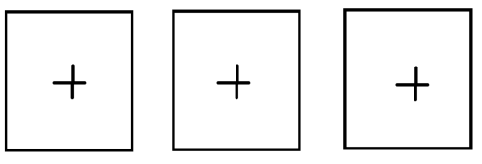

# Welcome to __Tradair__ 👋👋👋

Clone this repo to your local enviroment and run 'npm start' in __client folder && server folder__.  
in your browser you should see `<h1>Tradair Coding Assignment</h1>`.  
open the console and you should get a stream represents the prices of 3 selected currency pairs.

## Step one - create placeholders for your widgets
   
- create a functional component "Main" and render it below the h1 tag, pass _response_  as prop.
- give each placeholder a uniqe id and center the placeholders in the middle of the screen, use **css flexbox**. 
- **Drag & Drop** - The user should have the abillity to change the order of the placeholders.  
- add tooltips "Add Widget" when hovering over the placeholder's plus sign.
- add style as you wish.

## Step two - placeholder turning into widget
when placeholder is clicked, the user gets to choose a currency pair and amount.
the widget should show 2 dropdowns: currency pair and amount.
 - amount can be 1M - 5M
 - create list of available currency pairs, when a pair is selected - remove it from the list.
after selecting currency pair and amount:  
display the currencyPairName above the widget and the prices (bid & offer) at the top of the widget side by side.  

## step three
inside the Main component create a state to count how many times the user has clicked the bid/ offer buttons.  
use the following stracture:  
`{
usdIlsCouner: {bid: 0, offer: 0},    
eurUsdCounter: {bid: 0, offer: 0},  
usdJpyCounter: {bid: 0, offer: 0},  
}`  
from the Main component create a Child component.  
the Child component will only render 2 buttons (bid/ offer).  
update the state of Main component from the child component by clicking the bid/ offer buttons.  
since nothing is ever going to change inside child component, make sure the child component is going to be rendered only once.

